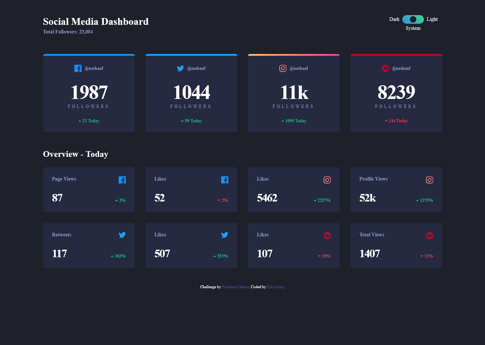

# Frontend Mentor - Social media dashboard with theme switcher solution

This is a solution to the [Social media dashboard with theme switcher challenge on Frontend Mentor](https://www.frontendmentor.io/challenges/social-media-dashboard-with-theme-switcher-6oY8ozp_H).

## Table of contents

- [Overview](#overview)
  - [The challenge](#the-challenge)
  - [Screenshot](#screenshot)
  - [Links](#links)
- [My process](#my-process)
  - [Built with](#built-with)
  - [What I learned](#what-i-learned)
- [Author](#author)
- [Acknowledgments](#acknowledgments)

## Overview

### The challenge

Users should be able to:

- View the optimal layout for the site depending on their device's screen size
- See hover states for all interactive elements on the page
- Toggle color theme to their preference

### Screenshot

### Links

- Solution URL: [github repository](https://github.com/ediCarlosSilva/fem-social-media-dashboard-dark-light-toggle)
- Live Site URL: [github page](https://edicarlossilva.github.io/fem-social-media-dashboard-dark-light-toggle/)

## My process

### Built with

- Semantic HTML5 markup
- CSS custom properties
- SCSS
- Gulp
- Flexbox
- CSS Grid

### What I learned

I advanced the style thinking and javascript logics in the toggle feature.

## Author

- Website - [Edi Carlos](https://edicarlossilva.github.io)
- Frontend Mentor - [@ediCarlosSilva](https://www.frontendmentor.io/profile/ediCarlosSilva)
- Github - [@ediCarlosSilva](hhttps://github.com/ediCarlosSilva)

## Acknowledgments

I thanks freecodecamp and Jess Chan from [coder coder](https://coder-coder.com/)
